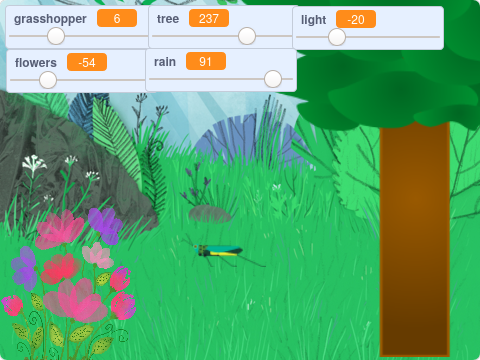

## Introduction

You are going to **develop** a serene (meaning peaceful) scene of a wood, that you can look at, listen to, and relax.

--- no-print ---

Click the green flag and then move the sliders to change the scene.

<iframe src="https://scratch.mit.edu/projects/397270866/embed" allowtransparency="true" width="485" height="402" frameborder="0" scrolling="no" allowfullscreen></iframe>

--- /no-print ---

--- print-only ---

--- /print-only ---

--- collapse ---
---
title: What you will need
---

### Hardware

+ A Computer or tablet capable of running Scratch

### Software

+ Scratch 3 (either [online](http://rpf.io/scratchon) or [offline](http://rpf.io/scratchoff))

--- /collapse ---

--- collapse ---
---
title: What you will learn
---

- How to create `variables`{:class="block3variables"}
- How to change the value of `variables`{:class="block3variables"} using sliders
- How to use `forever`{:class="block3control"} loops to check variable values.

--- /collapse ---

--- collapse ---
---
title: Additional information for educators
---

You can find the completed project [here](http://rpf.io/p/en/serene-scene-get){:target="_blank"}.

If you need to print this project, please use the [printer-friendly version](https://projects.raspberrypi.org/en/projects/serene-scene/print){:target="_blank"}.

--- /collapse ---
