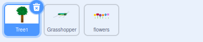
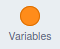
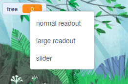
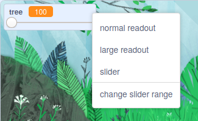

## Grow a tree

--- task ---

**Online:** open the [starter project](http://rpf.io/serene-scene-on){:target="_blank"} in Scratch.
 
**Offline:** open the [project starter file](http://rpf.io/p/en/serene-scene-go){:target="_blank"} in the Scratch offline editor. If you need to, you can [download and install Scratch here](https://scratch.mit.edu/download){:target="_blank"}.

--- /task ---

You should see a forest scene with a tree, flowers, and a grasshopper.


First, you will make the tree change its size.

--- task ---

Select the **Tree1** sprite from the Sprite list below the Stage.



--- /task ---

A **variable** is a way of storing numbers and/or text. 

--- task ---

To create a new `variable`{:class="block3variables"} in Scratch, click on the `Variables`{:class="block3variables"} blocks menu.

 

Then, click the **Make a Variable** button.


You can give your `variable`{:class="block3variables"} a name. Call this variable `tree`.


--- /task ---

You should now see five new blocks that you can use.

```blocks3
(tree)

set [tree v] to [0]

change [tree v] by [1]

show variable [tree v]

hide variable [tree v]
```

You will also see that the `tree`{:class="block3variables"} variable is visible on the Stage.


--- task ---

There are many ways to control the **value** of a `variable`{:class="block3variables"}, but in this project, you will use **sliders**.

On the Stage, right-click on the `tree`{:class="block3variables"} variable, and a menu will appear.



Select **slider** from the menu.


--- /task ---

--- task ---

Move the slider forwards and backwards, and you will see that the value of the `tree`{:class="block3variables"} variable changes between `0`{:class="block3variables"} and `100`{:class="block3variables"} (percent).

--- /task ---

Now, you will use the value of the `tree`{:class="block3variables"} variable to change the size of the tree.

--- task ---

First, use a `when green flag clicked`{:class="block3events"} block with a `forever`{:class="block3control"} loop. Add a `set size to`{:class="block3looks"} block into the loop.

This means that once the flag is clicked, the `set size to`{:class="block3looks"} block in the `forever`{:class="block3control"} loop will keep the tree size at 100%.


```blocks3
when flag clicked
forever
set size to [100] %
```

--- /task ---

--- task ---

Now, add the `tree`{:class="block3variables"} variable into the `set size to`{:class="block3looks"} block.

--- no-print ---


--- /no-print ---


```blocks3
when flag clicked
forever
+ set size to (tree) %
```

--- /task ---

You can now move the slider to adjust the size of the tree.

--- no-print ---


--- /no-print ---

At the moment, the tree size can only be changed from `0`{:class="block3variables"} to `100`{:class="block3variables"}.

--- task ---

On the Stage, right-click on the `tree`{:class="block3variables"} slider and select **change slider range**.



--- /task ---

--- task ---

Change the range to between `100` and `300`.


Now, move the slider to watch your tree grow in size from 100% to 300%.

--- /task ---

--- save ---


