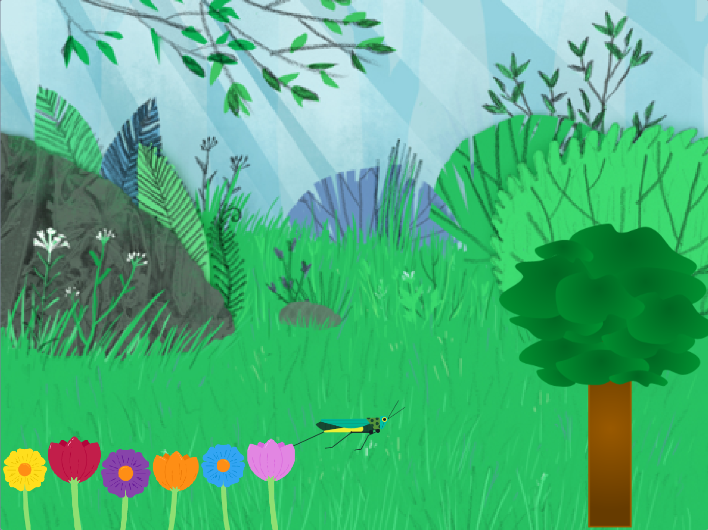
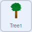

## Grow a tree

--- task ---

If working **online**, open the [starter project](http://rpf.io/p/en/serene-scene-on){:target="_blank"} in Scratch.
 
If working **offline**, open the project [starter file](http://rpf.io/p/en/serene-scene-get){:target="_blank"} in the Scratch offline editor. If you need to download and install Scratch, you can find it [here](https://scratch.mit.edu/download){:target="_blank"}.

--- /task ---

You should see a forest scene with a tree, flowers and a grasshopper.



To begin, you are going to to make the tree change its size.

--- task ---

Select the **Tree1** sprite.


--- /task ---

A `variable`{:class="block3variables"} is a way of storing numbers and/or text. 

--- task ---

Create a new `variable`{:class="block3variables"} in Scratch by clicking on the `variables`{:class="block3variables"} menu.

 

Then click on the **Make a variable** button.


You can give your `variable`{:class="block3variables"} a name. Call this variable `tree`{:class="block3variables"}.


--- /task ---

You should now see five new blocks that you can use.

```blocks3
(tree)

set [tree v] to [0]

change [tree v] by [1]

show variable [tree v]

hide variable [tree v]
```

You will also see that the `tree`{:class="block3variables"} variable is visible on the stage.


--- task ---

There are many ways to control the **value** of a `variable`{:class="block3variables"}, but in this project you are going to use `sliders`{:class="block3variables"}.

On the stage, right click on the variable and you should see a menu appear.


Select **slider** from the menu.


--- /task ---

--- task ---

Move the slider backwards and forward, and you will see that the value of the `variable`{:class="block3variables"} changes between `0`{:class="block3variables"} and `100`{:class="block3variables"}.

--- /task ---

Now you are going to use the value of the `tree`{:class="block3variables"} variable to change the size of the tree.

--- task ---

Use a `when flag clicked`{:class="block3events"} with a `forever`{:class="block3control"} loop to begin. Add in a `set size`{:class="block3looks"} block to the loop.

This means that once the flag is clicked, the `set size`{:class="block3looks"} in the `forever`{:class="block3control"} loop will keep the tree size at 100%.



```blocks3
when flag clicked
forever
set size to [100] %
```

--- /task ---

--- task ---

Now add the `tree`{:class="block3variables"} variable, into the `set size`{:class="block3looks"} block.

--- no-print ---


--- /no-print ---


```blocks3
when flag clicked
forever
+ set size to (tree) %
```

--- /task ---

You can now move the slider, to adjust the size of the tree

--- no-print ---


--- /no-print ---

At the moment the tree size can only be changed from `0`{:class="block3variables"} to `100`{:class="block3variables"}.

--- task ---

Right click on the `tree`{:class="block3variables"} slider on the stage and select **change slider range**


--- /task ---

--- task ---

Change the range from between `100`{:class="block3variables"} and `300`{:class="block3variables"}.


Now move the slider to watch your tree grow from 100% to 300%.

--- /task ---

--- save ---


