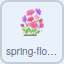

## Colour the flowers

You used a `tree`{:class="block3variables"} variable to change the `size`{:class="block3looks"} of the tree. Now, you can use a variable to change the colour of the flowers.

--- task ---

Click on the **flowers** sprite, then create a new variable called `flowers`. If you can't remember how to do this, go back to the previous step for a reminder.

--- /task ---

--- task ---

Change the `color effect`{:class="block3looks"} of the flowers, in the same way that you changed the `size`{:class="block3looks"} of the tree.



```blocks3
when flag clicked
forever
set [color v] effect to [0]
```

--- /task ---

--- task ---

Then, add in your `flowers`{:class="block3variables"} variable.


```blocks3
when flag clicked
forever
+ set [color v] effect to (flowers)
```

--- /task ---

Variables that store numbers do not always have to be greater than 0. You can use negative numbers as well.

--- task ---

On the Stage, right-click on the `flowers`{:class="block3variables"} variable and set it to **slider**.

Now, change the slider range to between `-100` and `100`.


--- /task ---

--- task ---

Click on the green flag, then adjust your `flowers`{:class="block3variables"} slider to see the flowers change colour.

--- /task ---

--- save ---


