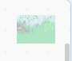

## Set the scene

In Scratch you can also add code to the Stage, rather than a Sprite. In this step you will change the brightness of the back drop and add some soothing sound effect.

--- task ---

Click on the stage's backdrop to select it.


Click on Create a new variable and call it `light`{:class="block3variables"}. Change the variable to a slider with a range between `-40`{:class="block3variables"} and `40`{:class="block3variables"}.

--- /task ---

--- task ---

Just as before, you can use this variable to change the appearance of the stage's backdrop.

Use the `set color effect`{:class="block3looks"} block, but use the dropdown menu to change `color`{:class="block3looks"} to `brightness`{:class="block3looks"}.




```blocks3
when flag clicked
forever
set [brightness v] effect to (light)
```

--- /task ---

Now when you adjust the light slider, you should see the forest change it's brightness so it looks like a dark evening or a bright summer's day.

--- task ---

You can also add sound effects to the stage. 

Click on the sounds tab for the stage.


--- /task ---

--- task ---

Click the icon in the bottom left of the screen to add a sound.


--- /task ---

--- task ---

You can now search for sounds. In this project we will use the rain sound, but you can choose anything you like.


--- /task ---

--- task ---

Create a `rain`{:class="block3variables"} variable and make it appear as a slider.

--- /task ---

--- task ---

Add code to play the `Rain`{:class="block3sounds"} sound forever, and change the volume of the sound to the value of the variable.


```blocks3
when flag clicked
forever
play sound [Rain v] until done

when flag clicke
forever
set volume to (rain) %

--- /task ---


You can now click the green flag to run your code and change the volume of the rain with the slider.


