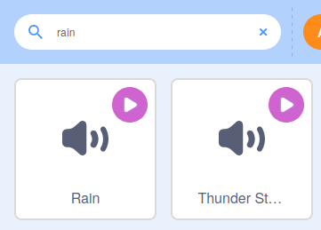

## Set the scene

In Scratch, you can also add code to the **Stage**, rather than a sprite. In this step, you will change the brightness of the backdrop and add some soothing sound effects.

--- task ---

Click on the Stage's backdrop. You will not develop a program n the code area for the backdrop.


Click on `Create a new variable`{:class="block3variables"} and call it `light`. Change the variable to a **slider** with a range between `-40` and `40`.

--- /task ---

--- task ---

Just as before, you can use this variable to change the appearance of the backdrop.

Use the `set color effect to`{:class="block3looks"} block, but use the drop-down menu to change `color`{:class="block3looks"} to `brightness`{:class="block3looks"}.


```blocks3
when flag clicked
forever
set [brightness v] effect to (light)
```

--- /task ---

Now, when you adjust the `light`{:class="block3variables"} slider, you should see the forest change its brightness so that it looks like a dark evening or a bright summer's day.

You can also add sound effects to the **Stage**.

--- task ---

To do this, click on the **Sounds** tab.


--- /task ---

--- task ---

Click on the icon in the bottom left-hand corner of the screen to add a sound.


--- /task ---

--- task ---

You can now search for sounds. In this project, we will use the **Rain** sound, but you can choose anything you like.



--- /task ---

--- task ---

Create a `rain`{:class="block3variables"} variable and make it appear as a **slider**.

--- /task ---

--- task ---

Add code to play the `Rain`{:class="block3sound"} sound forever, and change the volume of the sound to the value of the variable.


```blocks3
when flag clicked
forever
play sound [Rain v] until done

when flag clicked
forever
set volume to (rain) %
```

--- /task ---

Click on the green flag to run your code and change the volume of the rain with the slider.

--- save ---
