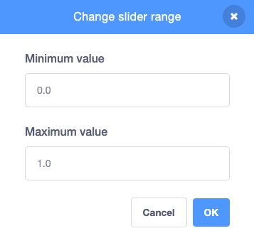

## Make the fauna move

**Fauna** means **animals**. In this step, you will add a moving grasshopper to your serene scene.

--- task ---

Set up the **Grasshopper** sprite so that it moves from left to right and appears behind the tree and flowers.


```blocks3
when flag clicked
go to [back v] layer
set rotation style [left-right v]
```

--- /task ---

--- task ---

Now, make your **Grasshopper** sprite move back and forth across the Stage.


```blocks3
when flag clicked
go to [back v] layer
set rotation style [left-right v]
+ forever
move [5] steps
next costume
if on edge, bounce
```
--- /task ---

The **Grasshopper** sprite is moving a little quickly at the moment, but you can use a `variable`{:class="block3variables"} and a `wait`{:class="block3control"} block to slow it down.

--- task ---

Create a new `variable`{:class="block3variables"} called `grasshopper` and switch it to a **slider**.

--- /task ---

--- task ---

Now, you can use a `wait`{:class="block3control"} block to slow the grasshopper down.


```blocks3
when flag clicked
go to [back v] layer
set rotation style [left-right v]
forever
move [5] steps
next costume
if on edge, bounce
+ wait (grasshopper) seconds
```

--- /task ---

If you click on the green flag and move the slider, you will notice that the grasshopper moves very slowly. To fix this, you need to change the range of the `grasshopper`{:class="block3variables"} variable to a much smaller range of numbers. 

--- task ---

On the Stage, right-click on the `grasshopper`{:class="block3variables"} variable and change the slider range to between `0.0` and `1.0`.



--- /task ---

--- task ---

Click on the green flag, then adjust your `grasshopper`{:class="block3variables"} slider to see the **Grasshopper** sprite change speed.

--- /task ---


