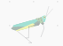

## Add some fauna

Fauna just means animals, and in this step you'll add a moving grasshopper to your serene scene.

--- task ---

Set up the grasshopper so that it moves from left to right and appears behind the trees and the flowers.



```blocks3
when flag clicked
go to [back v] layer
set rotation style [left-right v]
```

--- /task ---

--- task ---

Now make your grasshopper move back and forth across the screen.


```blocks3
when flag clicked
go to [back v] layer
set rotation style [left-right v]
+ forever
move [5] steps
next costume
if on edge, bounce
```
--- /task ---

The grasshopper is moving a little quickly at the moment, but you can slow it down using a `variable`{:class="block3variables"} and a `wait`{:class="block3control"} block.

--- task ---

Create a new variable and switch it to a slider. You can call the variable `grasshopper`{:class="block3"}.

--- /task ---

--- task ---

Now you can use a `wait`{:class="block3control"} block to slow the grasshopper down.


```blocks3
when flag clicked
go to [back v] layer
set rotation style [left-right v]
+ forever
move [5] steps
next costume
if on edge, bounce
wait (grasshopper) seconds
```

--- /task ---

If you click the greenflag and move the slider, you'll notice that the grasshopper moves very slowly. This can be fixed by multiplying the `grasshopper`{:class="block3variables"} variable by a number smaller that 1.

--- task ---

In the `Operators`{:class="block3operators"} menu, find the `multiply`{:class="block3operators"} block

```blocks3
[] / []
```

--- /task ---

--- task ---

Now drag this into your script to divide the `grasshopper`{:class="block3variables"} by 100.


```blocks3
when flag clicked
go to [back v] layer
set rotation style [left-right v]
+ forever
move [5] steps
next costume
if on edge, bounce
wait ((grasshopper) / [100]) seconds
```

--- /task ---

Now when you adjust the slider, the grasshopper will move at a different speed. You might also like to adjust the slider range down to between 0 and 20


