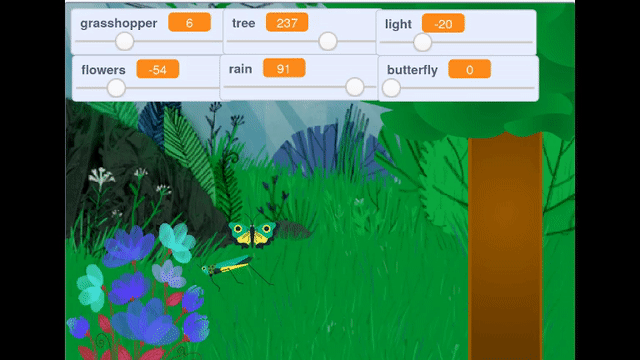

## Challenge: Add a butterfly

--- task ---

Add a butterfly sprite to your project, and use a variable slider to control the speed at which the butterfly moves. You could have it move from side to side, like the grasshopper, but for an extra challenge, can you make it move in random directions?

--- /task ---

