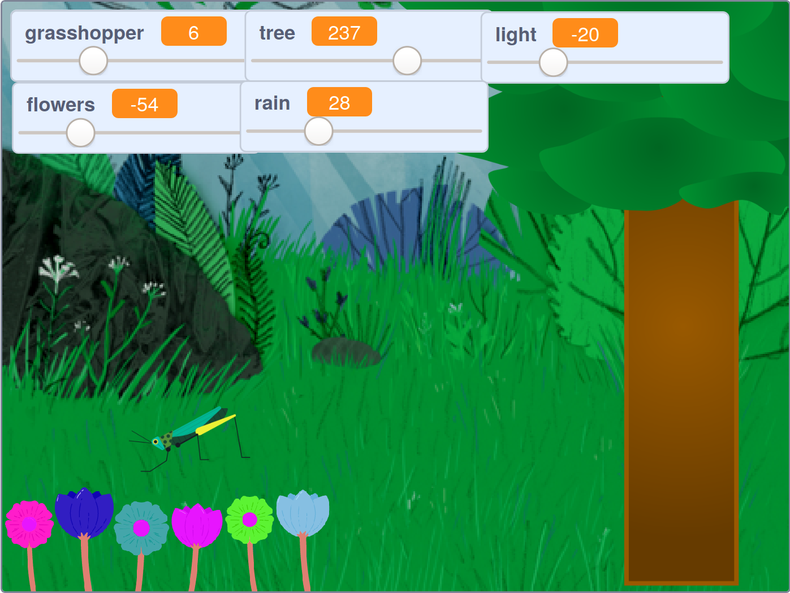

## परिचय

आप एक वन का एक प्रशान्त (अर्थात् शांतिपूर्ण) दृश्य विकसित करेंगे, जिसे आप देख सकते हैं, सुन सकते हैं और उसके साथ आराम कर सकते हैं।

--- no-print ---

हरे झंडे पर क्लिक करें, फिर दृश्य बदलने के लिए स्लाइडर्स को हिलाएँ।

<iframe src="https://scratch.mit.edu/projects/401955374/embed" allowtransparency="true" width="485" height="402" frameborder="0" scrolling="no" allowfullscreen></iframe>

--- /no-print ---

--- print-only ---

--- /print-only ---

--- collapse ---
---
title: आपको किन चीजों की आवश्यकता होगी
---

### हार्डवेयर
+ Scratch चलाने में सक्षम कंप्यूटर या टैबलेट

### सॉफ्टवेयर
+ Scratch 3 (या तो [ऑनलाइन](https://scratch.mit.edu/){:target="_blank"} या [ऑफलाइन](https://scratch.mit.edu/download){:target="_blank"})

### डाउनलोड
+  यदि आप ऑफ़लाइन काम कर रहे हैं, तो [प्रोजेक्ट स्टार्टर फ़ाइल](https://rpf.io/p/hi-IN/serene-scene-go){:target="_blank"} डाउनलोड करें

--- /collapse ---

--- collapse ---
---
title: आप क्या सीखेंगे
---

- `variables`{:class="block3variables"} कैसे बनाएं
- `variables`{:class="block3variables"} का मान बदलने के लिए स्लाइडर का उपयोग कैसे करें
- `forever`{:class="block3control"} लूप का उपयोग वेरिएबल का मान जानने के लिए कैसे करें

--- /collapse ---

--- collapse ---
---
title: शिक्षकों के लिए अतिरिक्त जानकारी
---

आप [का उपयोग करके पूरे प्रॉजेक्ट को यहाँ डाउनलोड कर सकते हैं](https://rpf.io/p/hi-IN/serene-scene-get){:target="_blank"}.

अगर आपको इस प्रोजेक्ट को प्रिंट करने की आवश्यकता है, तो कृप्या [प्रिंटर-अनुकूल संस्करण](https://projects.raspberrypi.org/hi-IN/projects/serene-scene/print){:target="_blank"} का उपयोग करें।

--- /collapse ---
