## एक पेड़ लगाएं

--- task ---

**ऑनलाइन**: Scratch में [स्टार्टर प्रोजेक्ट](http://rpf.io/serene-scene-on){:target="_blank"} खोलें ।

**ऑफ़लाइन:** Scratch के ऑफ़लाइन संपादक में [प्रोजेक्ट स्टार्टर फ़ाइल](http://rpf.io/p/hi-IN/serene-scene-go){:target="_blank"} खोलें। यदि आपको ज़रूरत है तो, आप [यहां Scratch डाउनलोड और इंस्टॉल ](https://scratch.mit.edu/download){:target="_blank"} कर सकते हैं

--- /task ---

आपको एक पेड़, फूल और एक टिड्डे के साथ जंगल का दृश्य दिखना चाहिए।

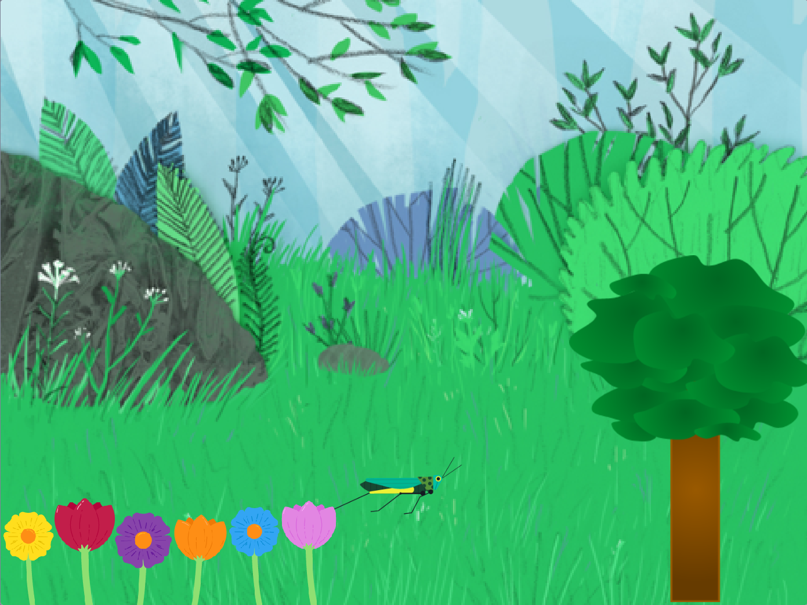

सबसे पहले, आप पेड़ से उसका उसका आकार बदलवाएँगे।

--- task ---

स्टेज के नीचे स्प्राइट सूची में **Tree1** स्प्राइट का चयन करें।

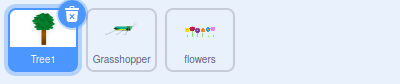

--- /task ---

**वेरिएबल (चर)** नंबर और/या टेक्स्ट को स्टोर करने का एक तरीका है।

--- task ---

Scratch में एक नया `variable`{:class="block3variables"} बनाने के लिए, ब्लॉक मेनू में`variable`{:class="block3variables"} पर क्लिक करें

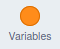

फिर, **Make a Variable** बटन पर क्लिक करें।

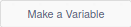

आप अपने `variable`{:class="block3variables"} को एक नाम दे सकते हैं। इस वेरिएबल को `tree` कहें।

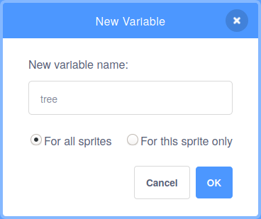

--- /task ---

अब आपको पांच नए ब्लॉक दिखने चाहिए जिनका आप उपयोग कर सकते हैं।

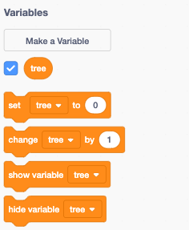

आप यह भी देखेंगे कि `tree`{:class="block3variables"} ब्लॉक के आगे एक चेक मार्क है। यह वेरियबल को Stage पर दृश्यमान बनाता है।

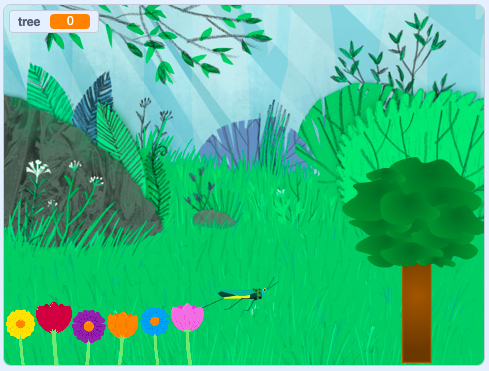

--- task ---

`variable`{:class="block3variables"} के **मान** को नियंत्रित करने के कई तरीके हैं, लेकिन इस प्रोजेक्ट में, आप **स्लाइडर** का उपयोग करेंगे.

Stage पर, `tree`{:class="block3variables"} वेरियबल पर राइट-क्लिक करें, और एक मेनू दिखाई देगा। (यदि आप टचस्क्रीन का उपयोग कर रहे हैं तो आप मेनू को प्रदर्शित करने के लिए इसपर टैप करें और होल्ड करें)।


मेनू में **slider** चुनें।


--- /task ---

--- task ---

स्लाइडर को आगे और पीछे ले जाएँ, और आप देखेंगे कि `tree`{:class="block3variables"} वेरिएबल का मान `0`{:class="block3variables"} और `100`{:class="block3variables"} (प्रतिशत) के बीच बदलता है।

--- /task ---

अब, आप पेड़ के आकार को बदलने के लिए `tree`{:class="block3variables"} वेरियबल के मान का उपयोग करेंगे।

--- task ---

सबसे पहले, `when green flag clicked`{:class="block3events"} ब्लॉक का उपयोग `forever`{:class="block3control"} लूप के साथ करें। लूप में `set size to`{:class="block3looks"} ब्लॉक जोड़ें।

इसका मतलब है कि एक बार जब झंडे पर क्लिक कर दिया जाता है, `set size to`{:class="block3looks"} ब्लॉक `forever`{:class="block3control"} का लूप पेड़ के आकार को ​`100` प्रतिशत पर रखेगा


```blocks3
when flag clicked
forever
set size to [100] %
```

--- /task ---

--- task ---

अब, `tree`{:class="block3variables"} वेरिएबल को `set size to`{:class="block3looks"} ब्लॉक में जोड़ें।

--- no-print ---

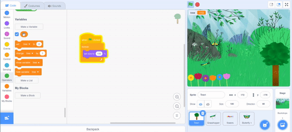

--- /no-print ---


```blocks3
when flag clicked
forever
+ set size to (tree) %
```

--- /task ---

अब आप पेड़ के आकार में फेरबदल करने के लिए स्लाइडर को आगे पीछे कर सकते हैं।

--- no-print ---

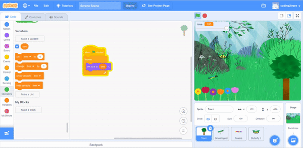

--- /no-print ---

फिलहाल, पेड़ का आकार केवल `0`{:class="block3variables"} से `100`{:class="block3variables"} में बदला जा सकता है।

--- task ---

Stage पर, `tree`{:class="block3variables"} स्लाइडर पर राइट-क्लिक करें और **change slider range** चुनें।

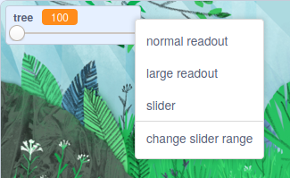

--- /task ---

--- task ---

सीमा को `100` और `300` के बीच बदलें।

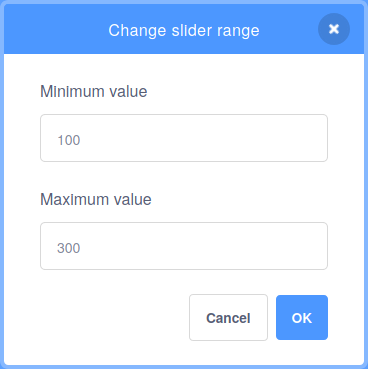

अब, अपने पेड़ को आकार में 100% से 300% तक बढ़ते हुए देखने के लिए स्लाइडर को आगे पीछे करें।

--- /task ---

--- save ---


