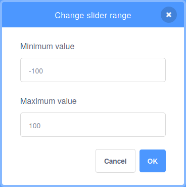

## फूलों को रंगें

आपने पेड़ के `size`{:class="block3looks"} को बदलने के लिए एक `tree`{:class="block3variables"} वेरियबल का उपयोग किया। अब, आप फूलों का रंग बदलने के लिए एक चर का उपयोग कर सकते हैं।

--- task ---

**flowers** स्प्राइट पर क्लिक करें, फिर एक नया `variable</1 {:class="block3variables"} बनाएं जिसे <code>flowers` कहा जाता है। यदि आपको यह याद नहीं है कि यह कैसे करना है, तो याद करने के लिए के लिए पिछले चरण पर वापस जाएं।

--- /task ---

--- task ---

फूलों के `color effect`{:class="block3looks"} को उसी तरह बदलें जैसे आपने पेड़ का `size`{:class="block3looks"} आकार बदला है.


```blocks3
when flag clicked
forever
set [color v] effect to [0]
```

--- /task ---

--- task ---

फिर, अपने वेरिएबल में फूल `flowers`{:class="block3variables"} जोड़ें।


```blocks3
when flag clicked
forever
+ set [color v] effect to (flowers)
```

--- /task ---

वेरिएबल जो संख्याओं को संग्रहीत करते हैं, उनके पास हमेशा 0 से अधिक मान नहीं होते हैं। आप ऋणात्मक संख्याओं का भी उपयोग कर सकते हैं।

--- task ---

Stage पर, `flowers`{:class="block3variables"} वेरिएबल पर राइट-क्लिक करें और इसे **slider** पर सेट करें।

अब, **slider range** को `-100` और `100` के बीच में बदलें।



--- /task ---

--- task ---

हरे रंग के झंडे पर क्लिक करें, फिर फूलों का रंग बदलने के लिए अपने `flowers`{:class="block3variables"} स्लाइडर को हिलाएँ।

--- /task ---

--- save ---


