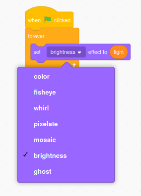
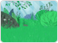
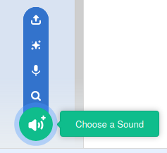
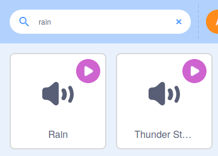

## दृश्य को स्थापित करें

Scratch में, आप स्प्राइट के बजाय **Stage** में भी कोड जोड़ सकते हैं। इस चरण में, आप बैक्ड्राप (पृष्ठभूमि) की चमक को बदल देंगे और कुछ सुखदायक ध्वनि प्रभाव जोड़ेंगे।

--- task ---

स्टेज पेन पर जाएं और **backdrop** पर क्लिक करें। अब आप Code क्षेत्र में पृष्ठभूमि **बैक्ड्राप** के लिए एक प्रोग्राम विकसित करेंगे।


`Variable`{:class="block3variables"} ब्लॉक मेनू में, **Make a Variable** पर क्लिक करें और नए वेरिएबल का नाम `light` रखें। वेरिएबल को **slider** में बदलें और रेंज (सीमा) `-40` और `40`बीच रखें।

--- /task ---

--- task ---

पहले की तरह ही, आप इस वेरिएबल का उपयोग बैकड्रॉप का रूप बदलने के लिए कर सकते हैं।

`set color effect to`{:class="block3looks"} ब्लॉक का उपयोग करें, लेकिन `color`{:class="block3looks"} को `brightness`{:class="block3looks"} में बदलने के लिए ड्रॉप-डाउन मेनू का उपयोग करें





```blocks3
when flag clicked
forever
set [brightness v] effect to (light)
```

--- /task ---

अब, जब आप `light`{:class="block3variables"} स्लाइडर को समायोजित करते हैं, तो आप देखेंगे कि जंगल की चमक बदल जाती है ताकि यह एक गहरी शाम या एक तेज़ गर्मी के दिन की तरह दिखे।

**Stage** पर आप ध्वनि प्रभाव भी जोड़ सकते हैं।

--- task ---

ऐसा करने के लिए, **Sounds** टैब पर क्लिक करें।


--- /task ---

--- task ---

ध्वनि का चयन करने के लिए स्क्रीन के निचले बाएं कोने में **choose a sound** आइकन पर क्लिक करें।



--- /task ---

--- task ---

अब आप ध्वनियों को खोज सकते हैं। इस परियोजना में, हम वर्षा **Rain** ध्वनि का उपयोग करेंगे, लेकिन आप अपनी पसंद की कोई भी चीज़ चुन सकते हैं। ध्वनि का चयन करने के **Rain** आइकन पर क्लिक करें।



--- /task ---

--- task ---

`Rain`{:class="block3variables"} वेरिएबल बनाएं और इसे **slider** रूप में प्रदर्शित करें।

--- /task ---

--- task ---

`play`{:class="block3sound"} कोड `Rain`{:class="block3sound"} ध्वनि `forever`{:class="block3control"} में जोड़ें, और ध्वनि की प्रबलता को `set`{:class="block3sound"} `volume`{:class="block3sound"} `rain`{:class="block3variables"} वेरिएबल में जोड़ें।


```blocks3
when flag clicked
forever
play sound [Rain v] until done

when flag clicked
forever
set volume to (rain) %
```

--- /task ---

अपना कोड चलाने के लिए हरे झंडे पर क्लिक करें और स्लाइडर के साथ बारिश की मात्रा बदलें।

--- save ---
