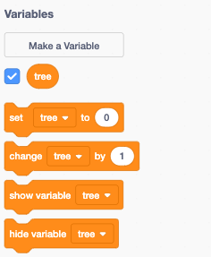
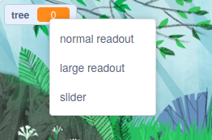
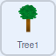
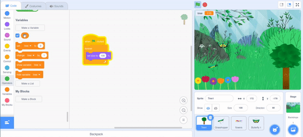
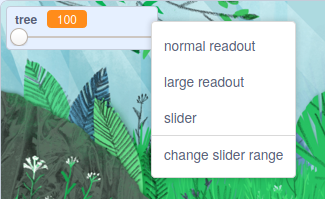

## ಮರವೊಂದನ್ನು ಬೆಳೆಸಿ

--- task ---

**ಆನ್‌ಲೈನ್:** ಸ್ಕ್ರಾಚ್‌ನಲ್ಲಿ [ಪ್ರಾರಂಭಿಕ ಪ್ರಾಜೆಕ್ಟ್](http://rpf.io/serene-scene-on){:target="_blank"} ತೆರೆಯಿರಿ.

**ಆಫ್‌ಲೈನ್:** ಸ್ಕ್ರಾಚ್‌ ಆಫ್‌ಲೈನ್‌ ಎಡಿಟರ್‌ನಲ್ಲಿ [ಪ್ರಾಜೆಕ್ಟ್‌ ಪ್ರಾರಂಭಿಕ ಫೈಲ್](http://rpf.io/p/kn-IN/serene-scene-go){:target="_blank"} ತೆರೆಯಿರಿ. ನಿಮಗೆ ಬೇಕಾದರೆ, ನೀವು [ಇಲ್ಲಿ Scratch ಡೌನ್‌ಲೋಡ್‌ ಮಾಡಿಕೊಂಡು ಇನ್‌ಸ್ಟಾಲ್‌ ಮಾಡಬಹುದು](https://scratch.mit.edu/download){:target="_blank"}.

--- /task ---

ನೀವು ಮರ, ಹೂವುಗಳು ಮತ್ತು ಮಿಡತೆಯಿರುವ ಕಾಡಿನ ದೃಶ್ಯವನ್ನು ನೋಡಬೇಕು.


ಮೊದಲಿಗೆ, ನೀವು ಮರದ ಗಾತ್ರವನ್ನು ಬದಲಾಯಿಸುತ್ತೀರಿ.

--- task ---

ಸ್ಟೇಜ್‌ ಕೆಳಗಿನ ಸ್ಪ್ರೈಟ್‌ ಲಿಸ್ಟ್‌ನಲ್ಲಿ **Tree1** ಸ್ಪ್ರೈಟ್‌ ಆಯ್ಕೆ ಮಾಡಿ.


--- /task ---

**variable** ಎಂದರೆ ಸಂಖ್ಯೆಗಳನ್ನು ಮತ್ತು/ಅಥವಾ ಅಕ್ಷರಗಳನ್ನು ಸಂಗ್ರಹಣೆ ಮಾಡುವ ವಿಧಾನ.

--- task ---

ಸ್ಕ್ರಾಚ್‌ನಲ್ಲಿ ಹೊಸ `variable`{:class="block3variables"} ರಚಿಸಲು ಬ್ಲಾಕ್‌ ಮೆನುನಲ್ಲಿ `Variables`{:class="block3variables"} ಮೇಲೆ ಕ್ಲಿಕ್‌ ಮಾಡಿ.


ನಂತರ **Make a Variable** ಬಟನ್‌ ಕ್ಲಿಕ್‌ ಮಾಡಿ.


ನೀವು ನಿಮ್ಮ`variable`{:class="block3variables"}ಗೆ ಹೆಸರು ಕೊಡಬಹುದು. ಈ ವೇರಿಯೇಬಲ್‌ನ್ನು `tree` ಎಂದು ಕರೆಯಿರಿ.


--- /task ---

ಈಗ ನೀವು ಬಳಸಬಹುದಾದ ಐದು ಹೊಸ ಬ್ಲಾಕ್‌ಗಳನ್ನು ನೋಡಬೇಕು.



`tree`{:class="block3variables"} ಬ್ಲಾಕ್‌ ಅದರ ಪಕ್ಕದಲ್ಲಿ ಚೆಕ್‌ ಗುರುತು ಹೊಂದಿರುವುದನ್ನು ಸಹ ನೀವು ನೋಡುವಿರಿ. ಇದು Stage ಮೇಲೆ ವೇರಿಯೇಬಲ್ ಗೋಚರಿಸುವಂತೆ ಮಾಡುತ್ತದೆ.


--- task ---

`variable`{:class="block3variables"} ನ **ಮೌಲ್ಯ** ವನ್ನು ನಿಯಂತ್ರಿಸಲು ಅನೇಕ ವಿಧಾನಗಳಿವೆ, ಆದರೆ ಈ ಪ್ರಾಜೆಕ್ಟ್‌ನಲ್ಲಿ ನೀವು **ಸ್ಲೈಡರ್ಸ್** ಉಪಯೋಗಿಸುತ್ತೀರಿ.

Stage ಮೇಲೆ, `tree`{:class="block3variables"} ವೇರಿಯೇಬಲ್‌ ಮೇಲ ರೈಟ್-ಕ್ಲಿಕ್‌ ಮಾಡಿ ಮತ್ತು ಒಂದು ಮೇನು ಕಾಣಿಸಿಕೊಳ್ಳುತ್ತದೆ. (ನೀವು ಟಚ್‌ಸ್ಕ್ರೀನ್ ಅನ್ನು ಬಳಸುತ್ತಿದ್ದರೆ ಮೆನು ಕಾಣಿಸಿಕೊಳ್ಳಲು ಟ್ಯಾಪ್ ಮಾಡಿ ಮತ್ತು ಹಿಡಿದಿಟ್ಟುಕೊಳ್ಳಬಹುದು).



ಮೆನುನಲ್ಲಿ **slider** ಆಯ್ಕೆ ಮಾಡಿಕೊಳ್ಳಿ.


--- /task ---

--- task ---

ಸ್ಲೈಡರ್‌ನ್ನು ಹಿಂದೆ ಮತ್ತು ಮುಂದೆ ಚಲಿಸಿ, ಮತ್ತು `tree`{:class="block3variables"} ವೇರಿಯೇಬಲ್‌ ಮೌಲ್ಯವು `0`{:class="block3variables"} ಮತ್ತು `100`{:class="block3variables"} (ಶೇಕಡಾ) ನಡುವೆ ಬದಲಾಗುವುದನ್ನು ಕಾಣಬಹುದು.

--- /task ---

ಈಗ, ನೀವು ಮರದ ಗಾತ್ರವನ್ನು ಬದಲಾಯಿಸಲು `tree`{:class="block3variables"} ವೇರಿಯೇಬಲ್‌ನ ಮೌಲ್ಯವನ್ನು ಉಪಯೋಗಿಸುವಿರಿ.

--- task ---

ಮೊದಲಿಗೆ, `when green flag clicked`{:class="block3events"} ಬ್ಲಾಕ್‌ನ್ನು`forever`{:class="block3control"}ಲೂಪ್‌ನೊಂದಿಗೆ ಉಪಯೋಗಿಸಿ. `set size to`{:class="block3looks"} ಬ್ಲಾಕ್‌ನ್ನು ಲೂಪ್‌ ಒಳಗೆ ಸೇರಿಸಿ.

ಇದರ ಅರ್ಥ ಒಮ್ಮೆ ಬಾವುಟವನ್ನು ಕ್ಲಿಕ್‌ ಮಾಡಿದರೆ, `forever`{:class="block3control"} ಲೂಪ್‌ನಲ್ಲಿರುವ`set size to`{:class="block3looks"} ಬ್ಲಾಕ್‌ ಮರದ ಗಾತ್ರವನ್ನು ಶೇಕಡಾ`100`ರಲ್ಲಿ ಇಡುತ್ತದೆ.



```blocks3
when flag clicked
forever
set size to [100] %
```

--- /task ---

--- task ---

ಈಗ, `tree`{:class="block3variables"} ವೇರಿಯೇಬಲ್‌ನ್ನು `set size to`{:class="block3looks"} ಬ್ಲಾಕ್‌ಗೆ ಸೇರಿಸಿ.

--- no-print ---



--- /no-print ---


```blocks3
when flag clicked
forever
+ set size to (tree) %
```

--- /task ---

ಮರದ ಗಾತ್ರವನ್ನು ಹೊಂದಿಸಲು ನೀವು ಈಗ ಸ್ಲೈಡರ್‌ ಚಲಿಸಬಹುದು.

--- no-print ---


--- /no-print ---

ಈ ಸಮಯದಲ್ಲಿ, ಮರದ ಗಾತ್ರವನ್ನು `0`{:class="block3variables"} ದಿಂದ `100`{:class="block3variables"}ವರೆಗೆ ಮಾತ್ರ ಬದಲಾಯಿಸಬಹುದು.

--- task ---

Stage ಮೇಲೆ, `tree`{:class="block3variables"} ಸ್ಲೈಡರ್‌ ಮೇಲೆ ರೈಟ್‌-ಕ್ಲಿಕ್‌ ಮಾಡಿ ಮತ್ತು **change slider range** ಆಯ್ಕೆ ಮಾಡಿಕೊಳ್ಳಿ.



--- /task ---

--- task ---

`100` ಮತ್ತು `300` ನಡುವೆ ಶ್ರೇಣಿಯನ್ನು ಬದಲಾಯಿಸಿ.


ಈಗ, ನಿಮ್ಮ ಮರ ಗಾತ್ರದಲ್ಲಿ 100% ದಿಂದ 300%ವರೆಗೆ ಬೆಳೆಯುವುದನ್ನು ನೋಡಲು ಸ್ಲೈಡರ್‌ ಚಲಿಸಿ.

--- /task ---

--- save ---


