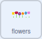

## ಹೂವಗಳಿಗೆ ಬಣ್ಣ ನೀಡಿ

ಮರದ `size`{:class="block3looks"}ಬದಲಾಯಿಸಲು ನೀವು `tree`{:class="block3variables"} ವೇರಿಯೇಬಲ್‌ ಉಪಯೋಗಿಸಿದ್ದೀರಿ. ಈಗ, ನೀವು ಹೂವುಗಳ ಬಣ್ಣವನ್ನು ಬದಲಾಯಿಸಲು ವೇರಿಯೇಬಲ್‌ ಉಪಯೋಗಿಸಬಹುದು.

--- task ---

**flowers** ಸ್ಪ್ರೈಟ್‌ ಮೇಲೆ ಕ್ಲಿಕ್ ಮಾಡಿ, ನಂತರ `flowers`ಎಂದು ಕರೆಯಲ್ಪಡುವ ಹೊಸ `variable`{:class="block3variables"} ರಚನೆ ಮಾಡಿ. ಇದನ್ನು ಹೇಗೆ ಮಾಡುವುದು ಎಂದು ನಿಮಗೆ ನೆನಪಿನಲ್ಲಿಟ್ಟುಕೊಳ್ಳಲು ಆಗದಿದ್ದರೆ, ಜ್ಞಾಪಿಸಿಕೊಳ್ಳಲು ಹಿಂದಿನ ಹಂತಕ್ಕೆ ಪುನಃ ಹೋಗಿ.

--- /task ---

--- task ---

ಮರದ `size`{:class="block3looks"} ಬದಲಾಯಿಸಿದ ವಿಧಾನದಲ್ಲಿಯೇ ಹೂವುಗಳ `color effect`{:class="block3looks"} ಬದಲಾಯಿಸಿ.



```blocks3
when flag clicked
forever
set [color v] effect to [0]
```

--- /task ---

--- task ---

ಆಮೇಲೆ, ನಿಮ್ಮ `flowers`{:class="block3variables"} ವೇರಿಯೇಬಲ್‌ ಸೇರಿಸಿ.


```blocks3
when flag clicked
forever
+ set [color v] effect to (flowers)
```

--- /task ---

ಸಂಖ್ಯೆಗಳನ್ನು ಸಂಗ್ರಹಣೆ ಮಾಡುವ ವೇರಿಯೇಬಲ್‌ಗಳು ಯಾವಾಗಲೂ 0 ಗಿಂತ ಹೆಚ್ಚಿನ ಮೌಲ್ಯ ಹೊಂದಿರಬೇಕಾಗಿಲ್ಲ. ನೀವು ನಕಾರಾತ್ಮಕ ಸಂಖ್ಯೆಗಳನ್ನು ಸಹ ಬಳಸಬಹುದು.

--- ಕಾರ್ಯ ---

Stage ಮೇಲೆ, `flowers`{:class="block3variables"} ವೇರಿಯೇಬಲ್‌ ಮೇಲೆ ರೈಟ್-ಕ್ಲಿಕ್‌ ಮಾಡಿ ಮತ್ತು ಅದನ್ನು **slider** ಗೆ ಹೊಂದಿಸಿ.

ಈಗ, **slider range** ನ್ನು `-100` ಮತ್ತು `100` ನಡುವೆ ಬದಲಾಯಿಸಿ.


--- /task ---

--- task ---

ಹಸಿರು ಬಾವುಟದ ಮೇಲೆ ಕ್ಲಿಕ್‌ ಮಾಡಿ, ನಂತರ ನಿಮ್ಮ `flowers`{:class="block3variables"} ಸ್ಲೈಡರ್‌ ಹೊಂದಿಸಿ, ಹೂವುಗಳು ಬಣ್ಣ ಬದಲಾಯಿಸುವುದನ್ನು ನೋಡಿ.

--- /ಕಾರ್ಯ ---

--- save ---


