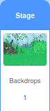
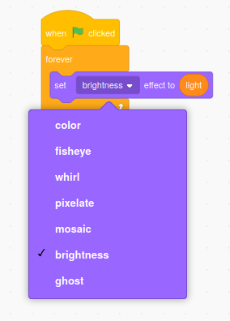
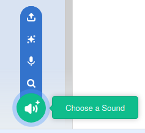
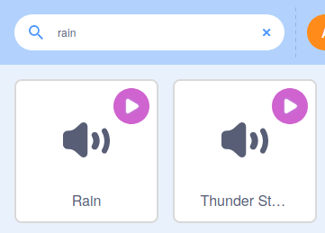

## ದೃಶ್ಯವನ್ನು ಹೊಂದಿಸಿ

ಸ್ಕ್ರಾಚ್‌ನಲ್ಲಿ, ನೀವು ಸ್ಪ್ರೈಟ್‌ಗೆ ಕೋಡ್‌ ಸೇರಿಸುವ ಬದಲು,**Stage**ಗೆ ಕೋಡ್‌ ಸೇರಿಸಬಹುದು. ಈ ಹಂತದಲ್ಲಿ, ನೀವು ಹಿನ್ನೆಲೆಯ ಹೊಳಪನ್ನು ಬದಲಾಯಿಸುವಿರಿ ಮತ್ತು ಕೆಲವು ಹಿತವಾದ ಧ್ವನಿಗಳ ಪರಿಣಾಮವನ್ನು ಸೇರಿಸುವಿರಿ.

--- task ---

Stage ಫಲಕಕ್ಕೆ ಹೋಗಿ, **backdrop** ಮೇಲೆ ಕ್ಲಿಕ್‌ ಮಾಡಿ. ನೀವು ಈಗ Code ಪ್ರದೇಶದಲ್ಲಿ **backdrop** ಗೆ ಪ್ರೋಗ್ರಾಮ್‌ ಅಭಿವೃದ್ಧಿಪಡಿಸುತ್ತೀರಿ.



`Variables`{:class="block3variables"} ಬ್ಲಾಕ್‌ ಮೆನುನಲ್ಲಿ **Make a Variable** ಮೇಲೆ ಕ್ಲಿಕ್‌ ಮಾಡಿ ಮತ್ತು ಹೊಸ ವೇರಿಯೇಬಲ್‌ `light`ನ್ನು ಆಹ್ವಾನಿಸಿ. ವೇರಿಯೇಬಲ್‌ನ್ನು **slider**ಗೆ `-40` ಮತ್ತು `40` ನಡುವಿನ ಶ್ರೇಣಿಯೊಂದಿಗೆ ಬದಲಾಯಿಸಿ.

--- /ಕಾರ್ಯ ---

--- ಕಾರ್ಯ ---

ಈ ಹಿಂದಿನದರಂತೆಯೇ, ನೀವು ಈ ವೇರಿಯೇಬಲ್‌ನ ಹಿನ್ನೆಲೆಯ ನೋಟವನ್ನು ಬದಲಾಯಿಸಲು ಉಪಯೋಗಿಸಬಹುದು.

`set color effect to`{:class="block3looks"} ಬ್ಲಾಕ್‌ ಉಪಯೋಗಿಸಿ, ಆದರೆ `color`{:class="block3looks"} ನ್ನು `brightness`{:class="block3looks"}ಗೆ ಬದಲಾಯಿಸಲು ಡ್ರಾಪ್-ಡೌನ್‌ ಮೆನು ಉಪಯೋಗಿಸಿ.




```blocks3
when flag clicked
forever
set [brightness v] effect to (light)
```

--- /task ---

ಈಗ, ನೀವು `light`{:class="block3variables"} ಸ್ಲೈಡರ್‌ ಹೊಂದಿಸಿದಾಗ, ಕತ್ತಲಾವರಿಸಿದ ಸಂಜೆ ಅಥವಾ ಪ್ರಕಾಶಮಾನವಾದ ಬೇಸಿಗೆಯ ದಿನದಂತೆ ಕಾಣುವಂತೆ ಅರಣ್ಯವು ಅದರ ಹೊಳಪನ್ನು ಬದಲಾಯಿಸುವುದನ್ನು ನೀವು ನೋಡಬೇಕು.

ನೀವು **Stage**ಗೆ ಧ್ವನಿಯ ಪರಿಣಾಮಗಳನ್ನೂ ಸಹ ಕೊಡಬಹುದು.

--- task ---

ಇದನ್ನು ಮಾಡಲು, **Sounds** ಟ್ಯಾಬ್‌ ಮೇಲೆ ಕ್ಲಿಕ್‌ ಮಾಡಿ.


--- /task ---

--- task ---

ಧ್ವನಿಯನ್ನು ಆಯ್ಕೆ ಮಾಡಲು ಪರದೆಯ ಕೆಳಗಿನ ಎಡ ಮೂಲೆಯಲ್ಲಿರುವ **Choose a Sound** ಐಕಾನ್ ಮೇಲೆ ಕ್ಲಿಕ್ ಮಾಡಿ.



--- /ಕಾರ್ಯ ---

--- task ---

ಈಗ ನೀವು ಧ್ವನಿಗಳನ್ನು ಹುಡುಕಬಹುದು. ಈ ಪ್ರಾಜೆಕ್ಟನಲ್ಲಿ, ನಾವು **Rain** ಶಬ್ದವನ್ನು ಉಪಯೋಗಿಸುತ್ತೇವೆ, ಆದರೆ ನೀವು ನಿಮಗೆ ಇಷ್ಟವಾದುದನ್ನು ಆಯ್ಕೆ ಮಾಡಿಕೊಳ್ಳಬಹುದು. ಶಬ್ದವನ್ನು ಆಯ್ಕೆ ಮಾಡಿಕೊಳ್ಳಲು **Rain** ಐಕಾನ್‌ ಮೇಲೆ ಕ್ಲಿಕ್‌ ಮಾಡಿ.



--- /task ---

--- task ---

`rain`{:class="block3variables"} ವೇರಿಯೇಬಲ್‌ ರಚಿಸಿ ಮತ್ತು ಅದು **slider** ಹಾಗೆ ಕಾಣುವಂತೆ ಮಾಡಿ.

--- /task ---

--- task ---

`play`{:class="block3sound"} ಕೋಡ್‌ನ್ನು `Rain`{:class="block3sound"} ಶಬ್ದ `forever`{:class="block3control"}ಗೆ ಸೇರಿಸಿ, ಮತ್ತು `rain`{:class="block3variables"} ವೇರಿಯೇಬಲ್‌ ಮೌಲ್ಯಕ್ಕೆ `set`{:class="block3sound"} `volume`{:class="block3sound"} ಸೆಟ್‌ ಮಾಡಿ.


```blocks3
when flag clicked
forever
play sound [Rain v] until done

when flag clicked
forever
set volume to (rain) %
```

--- /task ---

ನಿಮ್ಮ ಕೋಡ್‌ ರನ್‌ ಮಾಡಲು ಮತ್ತು ಸ್ಲೈಡರ್‌ನೊಂದಿಗೆ ಮಳೆಯ ವಾಲ್ಯೂಮ್‌ ಬದಲಾಯಿಸಲು ಹಸಿರು ಬಾವುಟದ ಮೇಲೆ ಕ್ಲಿಕ್‌ ಮಾಡಿ.

--- save ---
