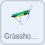

## ಪ್ರಾಣಿಗಳನ್ನು ಚಲಿಸುವಂತೆ ಮಾಡಿ

**ಪ್ರಾಣಿಸಂಕುಲ** ಅಂದರೆ **ಪ್ರಾಣಿಗಳು**. ಈ ಹಂತದಲ್ಲಿ, ನಿಮ್ಮ ಪ್ರಶಾಂತ ದೃಶ್ಯಕ್ಕೆ ನೀವು ಚಲಿಸುವ ಮಿಡತೆಯನ್ನು ಸೇರಿಸುತ್ತೀರಿ.

--- task ---

**Grasshopper** ಸ್ಪ್ರೈಟ್‌ನ್ನು ಅದು ಎಡದಿಂದ ಬಲಕ್ಕೆ ಚಲಿಸುವಂತೆ ಮತ್ತು ಮರ ಮತ್ತು ಹೂವುಗಳ ಹಿಂದೆ ಕಾಣುವಂತೆ ಹೊಂದಿಸಿ.



```blocks3
when flag clicked
go to [back v] layer
set rotation style [left-right v]
```

--- /task ---

--- task ---

ಈಗ, ನಿಮ್ಮ **Grasshopper** ಸ್ಪ್ರೈಟ್‌ ವೇದಿಕೆಯ ಉದ್ದಕ್ಕೆ ಹಿಂದೆ ಮತ್ತು ಮುಂದೆ ಚಲಿಸುವಂತೆ ಮಾಡಿ.


```blocks3
when flag clicked
go to [back v] layer
set rotation style [left-right v]
+ forever
move [5] steps
next costume
if on edge, bounce
```
--- /task ---

**Grasshopper** ಸ್ಪ್ರೈಟ್‌ ಈ ಕ್ಷಣದಲ್ಲಿ ಸ್ವಲ್ಪ ಬೇಗ ಬೇಗ ಚಲಿಸುತ್ತಿದೆ, ಆದರೆ ನೀವು ಅದನ್ನು ನಿಧಾನ ಮಾಡಲು `variable`{:class="block3variables"} ಮತ್ತು `wait`{:class="block3control"} ಬ್ಲಾಕ್‌ನ್ನುಉಪಯೋಗಿಸಬಹುದು.

--- task ---

`grasshopper` ಎನ್ನುವ ಹೊಸ `variable`{:class="block3variables"} ನ್ನು ರಚಿಸಿ ಮತ್ತು ಅದನ್ನು **slider** ಆಗಿ ಬದಲಿಸಿ.

--- /task ---

--- task ---

ಈಗ, ನೀವು `wait`{:class="block3control"} ಬ್ಲಾಕ್‌ನ್ನು ಮಿಡತೆಯನ್ನು ನಿಧಾನ ಮಾಡಲು ಉಪಯೋಗಿಸಬಹುದು.


```blocks3
when flag clicked
go to [back v] layer
set rotation style [left-right v]
forever
move [5] steps
next costume
if on edge, bounce
+ wait (grasshopper) seconds
```

--- /task ---

ನೀವು ಹಸಿರು ಬಾವುಟದ ಮೇಲೆ ಕ್ಲಿಕ್‌ ಮಾಡಿ ಸ್ಲೈಡರ್‌ ಚಲಿಸಿದರೆ, ನೀವು ಮಿಡತೆ ತುಂಬಾ ನಿಧಾನವಾಗಿ ಚಲಿಸುವುದನ್ನು ಗಮನಿಸಬಹುದು. ಇದನ್ನು ಸರಿಪಡಿಸಲು, ನೀವು `grasshopper`{:class="block3variables"} ವೇರಿಯೇಬಲ್‌ನ ಶ್ರೇಣಿಯನ್ನು ಹೆಚ್ಚು ಸಣ್ಣ ಸಂಖ್ಯೆಯ ಶ್ರೇಣಿಗೆ ಬದಲಾಯಿಸಬೇಕು.

--- task ---

Stage ಮೇಲೆ, `grasshopper`{:class="block3variables"} ವೇರಿಯೇಬಲ್‌ ಮೇಲೆ ರೈಟ್‌-ಕ್ಲಿಕ್‌ ಮಾಡಿ ಮತ್ತು ಸ್ಲೈಡರ್‌ ಶ್ರೇಣಿಯನ್ನು `0.0` ಮತ್ತು `1.0` ನಡುವೆ ಬದಲಾಯಿಸಿ.


--- /task ---

--- task ---

ಹಸಿರು ಬಾವುಟದ ಮೇಲೆ ಕ್ಲಿಕ್‌ ಮಾಡಿ, ನಂತರ **Grasshopper** ಸ್ಪ್ರೈಟ್‌ ವೇಗವನ್ನು ಬದಲಾಯಿಸುವುದನ್ನು ನೋಡಲು, ನಿಮ್ಮ `grasshopper`{:class="block3variables"} ಸ್ಲೈಡರ್‌ನ್ನು ಹೊಂದಿಸಿ.

--- /task ---


