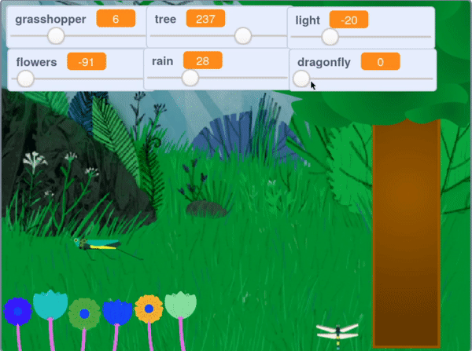

## ಇನ್ನಷ್ಟು ಸೇರಿಸಿ

--- task ---

**dragonfly** ಸ್ಪ್ರೈಟ್‌ನ್ನು ನಿಮ್ಮ ಪ್ರಾಜೆಕ್ಟ್‌ಗೆ ಸೇರಿಸಿ, ಮತ್ತು ಡ್ರಾಗನ್‌ಫೈ ಚಲಿಸುವ ವೇಗವನ್ನು ನಿಯಂತ್ರಿಸಲು `variable`{:class="block3variables"} ಸ್ಲೈಡರ್‌ ಉಪಯೋಗಿಸಿ. ಡ್ರಾಗನ್ ಫ್ಲೈ ಮಿಡತೆಯಂತೆ ಅಕ್ಕಪಕ್ಕಕ್ಕೆ ಚಲಿಸಬಲ್ಲದು.

--- /task ---

