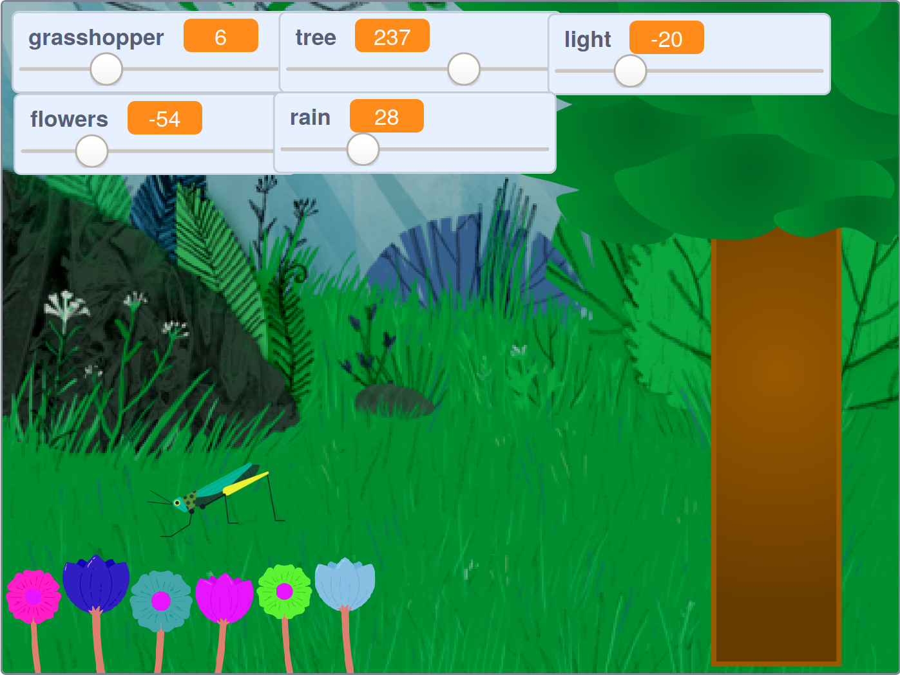

## परिचय

तुम्ही लाकडाचे एक प्रसन्न (म्हणजे शांततापूर्ण) दृश्य विकसित कराल, जे तुम्ही पाहू शकता, ऐकू शकता आणि त्यासोबत रीलॅक्स राहू शकता.

--- no-print ---

हिरव्या झेंड्यावर क्लिक करा, त्यानंतर दृश्य बघण्यासाठी स्लाइडर हलवा.

<iframe src="https://scratch.mit.edu/projects/401955374/embed" allowtransparency="true" width="485" height="402" frameborder="0" scrolling="no" allowfullscreen></iframe>

--- /no-print ---

--- print-only ---

--- /print-only ---

--- collapse ---
---
title: तुम्हाला काय लागणार
---

### हार्डवेअर
+ Scracth चालवण्यास सक्षम असलेले संगणक किंवा टॅबलेट

### सॉफ्टवेअर
+ Scratch 3 (एकतर [ऑनलाईन](https://scratch.mit.edu/){:target="_blank"} किंवा [ऑफलाईन](https://scratch.mit.edu/download){:target="_blank"})

### डाउनलोड्स
+  तुम्ही ऑफलाइन काम करत असल्यास, [प्रोजेक्ट स्टार्टर फाइल](https://rpf.io/p/mr-IN/serene-scene-go){:target="_blank"} डाऊनलोड करा

--- /collapse ---

--- collapse ---
---
title: तुम्ही काय शिकणार
---

- `व्हेरिएबल्स`{:class="block3variables"} कसे तयार करावे
- `variables`{:class="block3variables"} ची व्हॅल्यू बदलण्यासाठी स्लाइडर कसे वापरायचे
- व्हेरिएबल व्हॅल्यू तपासण्यासाठी `forever`{:class="block3control"} लूप कसे वापरावे

--- /collapse ---

--- collapse ---
---
title: शिक्षकांसाठी अतिरिक्त माहिती
---

आपण [येथे पूर्ण केलेला प्रोजेक्ट शोधू शकता](https://rpf.io/p/mr-IN/serene-scene-get){:target="_blank"}.

तुम्हाला हा प्रोजेक्ट प्रिंट करणे आवश्यक असल्यास, कृपया [छपाईयंत्र अनुकूल आवृत्ती](https://projects.raspberrypi.org/mr-IN/projects/serene-scene/print){:target="_blank"} वापरा.

--- /collapse ---
