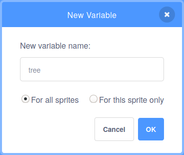

## झाड वाढवा

--- task ---

**ऑनलाईन:** Scratch मधील [स्टार्टर प्रोजेक्ट](http://rpf.io/serene-scene-on){:target="_blank"} उघडा.

**ऑफलाईन:** Scratch ऑफलाईन एडिटर मध्ये [ प्रोजेक्ट स्टार्टर फाईल](http://rpf.io/p/en/serene-scene-go){:target="_blank"} उघडा. तुम्हाला आवश्यक असल्यास, तुम्ही [येथे Scratch डाऊनलोड आणि इंस्टॉल करा](https://scratch.mit.edu/download){:target="_blank"}.

--- /task ---

तुम्ही झाड, फुले, आणि गवती टोळ यांसह जंगलाचे दृश्य बघायला हवे.


प्रथम, तुम्ही आकार बदलणारे झाड तयार कराल.

--- task ---

Stage च्या खालील Sprite लीस्टमध्ये **Tree1** स्प्राईट निवडा.


--- /task ---

**व्हेरिएबल** हा संख्या आणि/किंवा टेक्स्ट स्टोअर करण्याचा पर्याय आहे.

--- task ---

Scratch मध्ये नवीन `variable`{:class="block3variables"} तयार करण्यासाठी, `Variables`{:class="block3variables"} ब्लॉक मेनूवर क्लिक करा.


त्यानंतर, **Make a Variable** बटनवर क्लिक करा.


तुम्ही तुमच्या `variable`{:class="block3variables"} ला नाव द्या. या व्हेरिएबलला `tree` म्हणा.



--- /task ---

आता तुम्हाला पाच नवीन ब्लॉक दिसतील जे तुम्ही वापरू शकता.


तुम्हाला हे देखील दिसेल की `tree`{:class="block3variables"} ब्लॉकच्या पुढे एक चेक मार्क आहे. हे व्हेरिएबल Stage वर दिसते.


--- task ---

`variable`{:class="block3variables"} चे **व्हॅल्यू** नियंत्रीत करण्यारे बरेच पर्याय आहेत, परंतु या प्रोजेक्टमध्ये, तुम्ही **स्लाईडर्स** वापराल.

Stage वर, `tree`{:class="block3variables"} व्हेरिएबलवर राईट-क्लिक करा, आणि मेनू दिसेल. (तुम्ही टचस्क्रीनचा वापर करत असलात, तर तुम्ही मेनू दिसण्यासाठी टॅप आणि होल्ड करू शकता).


मेनूमध्ये **slider** निवडा.


--- /task ---

--- task ---

स्लाईडर पुढे आणि मागे हलवा, आणि तुम्हाला `tree`{:class="block3variables"} व्हेरिएबलची व्हॅल्यू `0`{:class="block3variables"} आणि `100`{:class="block3variables"} (टक्के) दरम्यान बदलतांना दिसेल.

--- /task ---

आता, तुम्ही झाडाचा आकार बदलण्यासाठी `tree`{:class="block3variables"} व्हेरिएबलच्या व्हॅल्यूचा वापर कराल.

--- task ---

प्रथम, `when green flag clicked`{:class="block3events"} ब्लॉक `forever`{:class="block3control"} लूपसह वापरा. लूपमध्ये `set size to`{:class="block3looks"} ब्लॉक जोडा.

याचा अर्थ असा की, झेंड्यावर क्लिक केल्यावर, `forever`{:class="block3control"} लूपमधील `set size to`{:class="block3looks"} ब्लॉक झाडाचा आकार `100` टक्क्यांमध्ये ठेवेल.


```blocks3
when flag clicked
forever
set size to [100] %
```

--- /task ---

--- task ---

आता, `set size to`{:class="block3looks"} ब्लॉकमध्ये `tree`{:class="block3variables"} व्हेरिएबल जोडा.

--- no-print ---


--- /no-print ---


```blocks3
when flag clicked
forever
+ set size to (tree) %
```

--- /task ---

तुम्ही आता झाडाचा आकार ऍडजस्ट करण्यासाठी स्लाईडर हलवू शकता.

--- no-print ---


--- /no-print ---

सध्या, झाडाचा आकार केवळ `0`{:class="block3variables"} ते `100`{:class="block3variables"} पर्यंत बदलू शकतो.

--- task ---

Stage वर, `tree`{:class="block3variables"} स्लाईडरवर राईट क्लिक करा आणि **change slider range** निवडा.


--- /task ---

--- task ---

`100` आणि `300` दरम्यान रेंद बदला.


आता, तुमच्या झाडाचा आकार 100% ते 300% पर्यंत वाढतांना बघण्यासाठी स्लाईडर हलवा.

--- /task ---

--- save ---


