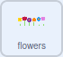
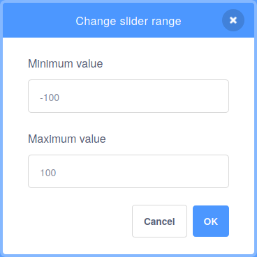

## फुलांना रंग द्या

तुम्ही झाडाचा `size`{:class="block3looks"} बदलण्यासाठी `tree`{:class="block3variables"} व्हेरिएबल वापरलात. आता, तुम्ही फुलांचा रंग बदलण्यासाठी व्हेरिएबल वापरू शकता.

--- task ---

**flowers** स्प्राइट वर क्लिक करा, नंतर `flowers` नावाचे `variable`{:class="block3variables"} तयार करा. हे कसे करायचे ते तुम्हाला आठवत नसल्यास, आठवण्यासाठी मागील टप्प्यावर परत जा.

--- /task ---

--- task ---

तुम्ही झाडाचा `size`{:class="block3looks"} बदलला त्याचप्रकारे फुलांचा `color effect`{:class="block3looks"} बदला.



```blocks3
when flag clicked
forever
set [color v] effect to [0]
```

--- /task ---

--- task ---

त्यानंतर तुमच्या `flowers`{:class="block3variables"} मध्ये जोडा.


```blocks3
when flag clicked
forever
+ set [color v] effect to (flowers)
```

--- /task ---

संख्या स्टोअर केलेल्या व्हेरिएबल्सला नेहमी 0 पेक्षा मोठ्या व्हॅल्यू असणे आवश्यक नसते. तुम्ही ऋण संख्या देखील वापरू शकता.

--- task ---

Stage वर, `flowers`{:class="block3variables"} व्हेरिएबलवर राईट-क्लिक करा आणि ते **slider** ला सेट करा.

आता, **slider range** ही `-100` आणि `100` दरम्यान बदला.



--- /task ---

--- task ---

हिरव्या झेंड्यावर क्लिक करा, त्यानंतर फुल रंग बदलतात का हे बघण्यासाठी तुमचे `flowers`{:class="block3variables"} स्लाईडर ऍडजस्ट करा.

--- /task ---

--- save ---


