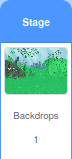

## दृश्य सेट करा

Scratch मध्ये, तुम्ही स्प्राईटऐवजी **Stage** ला कोड जोडू शकता. या टप्प्यात, तुम्ही बॅकड्रॉपचा ब्राईटनेस बदलाल आणि काही सुखदाकय साऊंड परिणाम जोडाल.

--- task ---

Stage पेनवर जा आणि **backdrop** वर क्लिक करा. Code एरियामधील **backdrop** साठी तुम्ही आता प्रोग्राम विकसीत कराल.



`Variables`{:class="block3variables"} ब्लॉक मेनूमध्ये, **Make a Variable** वर क्लिक करा आणि नवीन व्हेरिएबल `light` बोलवा. `-40` आणि `40` दरम्यान रेंजसह **slider** ला व्हेरिएबल बदला.

--- /task ---

--- task ---

आधीप्रमाणे, तुम्ही बॅकड्रॉपचे स्वरूप बदलण्यासाठीया व्हेरिएबलचा वापर करू शकता.

`set color effect to`{:class="block3looks"} ब्लॉक वापरा, परंतु `color`{:class="block3looks"} ते `brightness`{:class="block3looks"} बदलण्यासाठी ड्रॉप-डाऊन मेनूचा वापर करा.


```blocks3
when flag clicked
forever
set [brightness v] effect to (light)
```

--- /task ---

आता, जेव्हा तुम्ही `light`{:class="block3variables"} स्लाईडर ऍडजस्ट करता, तुम्ही जंगल त्याचा ब्राईटनेस बदलत असल्याचे बघायला हवे जेणेकरून ते अंधारमय सायंकाळ किंवा उन्हाळ्यातील प्रकाशमय दिवस यांसारखे दिसेल.

तुम्ही **Stage** यावर साऊंड परिणाम सुद्धा जोडू शकता.

--- task ---

हे करण्यासाठी, **Sounds** टॅबवर क्लिक करा.


--- /task ---

--- task ---

साऊंंड निवडण्यासाठी स्क्रीनच्या तळाशी डाव्या कोपर्‍यात **Choose a Sound** आयकॉनवर क्लिक करा.


--- /task ---

--- task ---

तुम्ही आता साऊंड शोधू शकता. या प्रोजेक्टमध्ये, आम्ही **Rain** साऊंड वापरेल, परंतु तुम्ही तुम्हाला आवडेल ते निवडू शकता. साऊंड निवडण्यासाठी **Rain** आयकॉनवर क्लिक करा.


--- /task ---

--- task ---

`rain`{:class="block3variables"} व्हेरिएबल तयार करा आणि त्याचे स्वरूप **slider** असे करा.

--- /task ---

--- task ---

`play`{:class="block3sound"} `Rain`{:class="block3sound"} साऊंड `forever`{:class="block3control"} ला कोड जोडा, आणि `rain`{:class="block3variables"} व्हेरिएबलच्या व्हॅल्यूला साऊंडचा `volume`{:class="block3sound"} `set`{:class="block3sound"}.


```blocks3
when flag clicked
forever
play sound [Rain v] until done

when flag clicked
forever
set volume to (rain) %
```

--- /task ---

तुमचा कोड रन करण्यासाठी हिरव्या झेंड्यावर क्लिक करा आणि स्लाईडर सह पावसाचा व्हॉल्यूम बदला.

--- save ---
