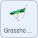
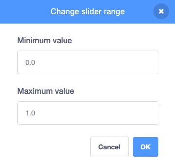

## जीवजंतू हलवा

**जीवजंतू** म्हणजे **प्राणी**. या टप्प्यात, तुम्ही तुमच्या प्रसन्न दृश्यात हलणारे गवती टोळ जोडाल.

--- task ---

**Grasshopper** स्प्राईट सेट करा जेणेकरून ते झाड आणि फुलांमध्ये डावीकडून उजवीकडे हलतील.



```blocks3
when flag clicked
go to [back v] layer
set rotation style [left-right v]
```

--- /task ---

--- task ---

आता, तुमच्या **Grasshopper** स्प्राईटला स्टेजभोवती मागे आणि पुढे हलू द्या.


```blocks3
when flag clicked
go to [back v] layer
set rotation style [left-right v]
+ forever
move [5] steps
next costume
if on edge, bounce
```
--- /task ---

**Grasshopper** स्प्राईट या क्षणात थोडे जलद हलत आहेत, परंतु तुम्ही `variable`{:class="block3variables"} चा आणि `wait`{:class="block3control"} ब्लॉकचा त्याला हळू करण्यासाठी वापर करू शकता.

--- task ---

नवीन`variable`{:class="block3variables"} ज्याला `grasshopper` म्हणतात तो तयार करा आणि तो **slider** मधे बदला.

--- /task ---

--- task ---

आता, grasshopper हळू करण्यासाठी`wait`{:class="block3control"} ब्लॉक वापरू शकता.


```blocks3
when flag clicked
go to [back v] layer
set rotation style [left-right v]
forever
move [5] steps
next costume
if on edge, bounce
+ wait (grasshopper) seconds
```

--- /task ---

हिरव्या झेंड्यावर तुम्ही क्लिक केल्यास आणि स्लाईडर हलवल्यास, तुम्हाला grasshopper फार हळूवार हलत असल्याचे दिसेल. हे दुरूस्त करण्यासाठी, तुम्हाला `grasshopper`{:class="block3variables"} व्हेरिएबलची रेंज संख्येच्या फार कमी रेंजमध्ये बदलायला हवी.

--- task ---

Stage वर, `grasshopper `{:class="block3variables"} व्हेरिएबलवर राईट-क्लिक करा आणि स्लाईडरची रेंज `0.0` आणि `1.0` दरम्यान बदला.



--- /task ---

--- task ---

हिरव्या झेंड्यावर क्लिक करा, त्यानंतर **Grasshopper** स्प्राईटची बदलणारी गती बघण्यासाठी तुमचा `grasshopper`{:class="block3variables"} स्लाईडर ऍडजस्ट करा.

--- /task ---


