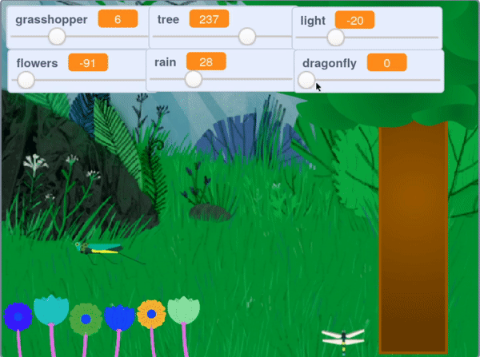

## आणखी जोडा

--- task ---

तुमच्या प्रोजेक्टला **dragonfly** स्प्राईट जोडा, आणि ड्रॅगनफ्लायने हलायच्या गतीला नियंत्रीत करण्यासाठी `variable`{:class="block3variables"} स्लाईडरचा वापर करा. dragonfly गवती टोळाप्रमाणे बाजूबाजूने हलू शकतात.

--- /task ---

