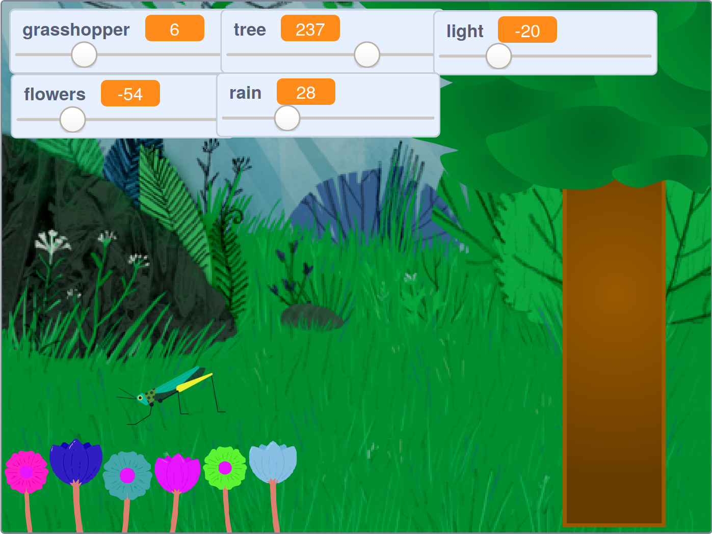

## పరిచయం

మీరు చూడదగిన, వినదగిన, కాస్త రిలాక్స్ అవగలిగిన, ప్రశాంతమైన అటవీ దృశ్యాన్ని తయారు చేస్తారు.

--- no-print ---

దృశ్యాన్ని మార్చడానికి, ఆకుపచ్చ జెండాపై క్లిక్ చేసి, స్లయిడర్‌లను మూవ్ చేయండి

<iframe src="https://scratch.mit.edu/projects/401955374/embed" allowtransparency="true" width="485" height="402" frameborder="0" scrolling="no" allowfullscreen></iframe>

--- /no-print ---

--- print-only ---

--- /print-only ---

--- collapse ---
---
title: మీకు కావల్సినవి
---

### హార్డవేర్
+ Scratch ని అమలు చేయగల సామర్థ్యం ఉన్న కంప్యూటర్ లేదా టాబ్లెట్

### సాఫ్ట్‌వేర్
+ Scratch 3 ( [online](https://scratch.mit.edu/){:target="_blank"} లేదా [offline](https://scratch.mit.edu/download){:target="_blank"})

### డౌన్‌లోడ్‌లు
+  మీరు ఆఫ్‌లైన్‌లో పని చేస్తుంటే, [ప్రాజెక్ట్ స్టార్టర్ ఫైల్](https://rpf.io/p/en/serene-scene-go){:target="_blank"}ని డౌన్‌లోడ్ చేయండి

--- /collapse ---

--- collapse ---
---
title: మీరు నేర్చుకోబోయేది
---

- `వేరియబుల్స్`{:class="block3variables"}ని ఎలా సృష్టించాలి
- `వేరియబుల్స్`{:class="block3variables"} విలువను మార్చడానికి స్లయిడర్‌లను ఎలా ఉపయోగించాలి
- `forever`{:class="block3control"} లూప్‌లను ఎలా ఉపయోగించాలి

--- /collapse ---

--- collapse ---
---
title: అధ్యాపకులకు అదనపు సమాచారం
---

మీరు [పూర్తి ప్రాజెక్ట్ ఇక్కడ డౌన్ లోడ్ చేయవచ్చు](https://rpf.io/p/en/serene-scene-get){: target = "_ blank"}.

మీరు ఈ ప్రాజెక్ట్‌ను ప్రింట్ చేయాలనుకుంటే, దయచేసి [ప్రింటర్ అనుకూల వెర్షన్](https://projects.raspberrypi.org/en/projects/serene-scene/print){:target="_blank"}ని ఉపయోగించండి.

--- /కొలాప్స్ ---
