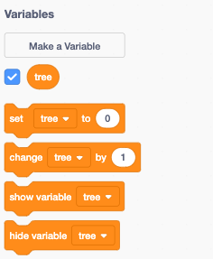
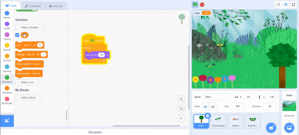
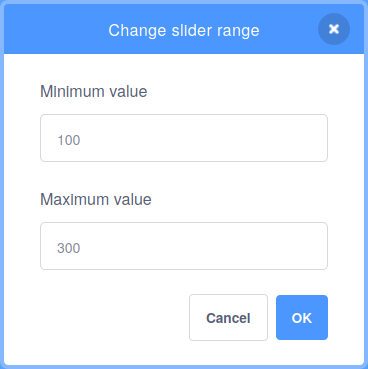

## Grow a tree

--- task ---

**Online:** Scratch లో [స్టార్టర్ ప్రాజెక్ట్ ](http://rpf.io/serene-scene-on){:target="_blank"} ని తెరవండి.

**Offline:** Scratch యొక్క ఆఫ్ లైన్ ఎడిటర్ లో [ప్రాజెక్టు స్టార్టర్ ఫైల్](http://rpf.io/p/en/serene-scene-go){:target="_blank"} ని తెరవండి. మీకు అవసరమైతే, మీరు [ఇక్కడ Scratch ను డౌన్ లోడ్ చేసి ఇన్‌స్టాల్ చేయవచ్చు.](https://scratch.mit.edu/download){:target="_blank"}.

--- /task ---

చెట్టు, పూలు, మిడుతలతో కూడిన అటవీ దృశ్యాన్ని మీరు చూడగలగాలి.


మొదట, మీరు చెట్టు యొక్క పరిమాణం మారేలా చేస్తారు.

--- task ---

Stage దిగువన ఉన్న sprite జాబితాలో **Tree1** sprite ని ఎంచుకోండి.


--- /task ---

** variable ** అనేది సంఖ్య మరియు/లేదా వచనాన్ని నిల్వ చేసే మార్గం.

--- task ---

Scratch లో కొత్త `variable`{:class="block3variables"}ని సృష్టించడానికి, `Variables`{:class="block3variables"} బ్లాక్‌ల మెనుపై క్లిక్ చేయండి.


ఆపై, **Make a Variable** బటన్‌ను క్లిక్ చేయండి.


మీరు మీ ` variable `{:class="block3variables"} కి పేరు పెట్టవచ్చు. ఈ వేరియబుల్‌ని `tree` అని పిలవండి.


--- /task ---

ఇప్పుడు మీరు, ఉపయోగించగల ఐదు కొత్త బ్లాక్‌లను చూడగలగాలి.



`tree`{:class="block3variables"} బ్లాక్‌కి పక్కన చెక్ మార్క్ ఉన్నట్లు కూడా చూస్తారు. ఇది Stage పైన వేరియబుల్ కనిపించేలా చేస్తుంది.


--- task ---

` variable `{:class="block3variables"} యొక్క **value** ని నియంత్రించడానికి అనేక మార్గాలు ఉన్నాయి కానీ ఈ ప్రాజెక్ట్ లో **sliders**. ని ఉపయోగించవచ్చు.

Stage మీద `tree`{:class="block3variables"} వేరియబుల్‌పై రైట్ - క్లిక్ చేయండి మరియు మెను కనిపిస్తుంది. (మీరు టచ్‌స్క్రీన్‌ని ఉపయోగిస్తుంటే, మెను కనిపించేలా చేయడానికి మీరు నొక్కి పట్టుకోవచ్చు).


మెనులో **slider** ను ఎంచుకోండి.


--- /task ---

--- task ---

స్లయిడర్‌ను ముందుకు వెనుకకు తరలించండి మరియు `tree`{:class="block3variables"} వేరియబుల్ విలువ `0`{:class="block3variables"} మరియు `100`{:class=" block3variables"} మధ్య మారడం మీరు చూస్తారు. (శాతం).

--- /task ---

ఇప్పుడు మీరు, చెట్టు పరిమాణాన్ని మార్చడానికి `tree`{:class="block3variables"} వేరియబుల్ విలువను ఉపయోగిస్తారు.

--- task ---

ముందుగా, `forever`{:class="block3control"} లూప్‌తో, `when green flag clicked`{:class="block3events"} బ్లాక్‌ని ఉపయోగించండి. `set size to`{:class="block3looks"} బ్లాక్ ని లూప్ కి జోడించండి.

దీనర్థం, ఫ్లాగ్‌ని క్లిక్ చేసిన తర్వాత, `forever`{:class="block3control"} లూప్‌లో `set size to`{:class="block3looks"} బ్లాక్, చెట్టు పరిమాణాన్ని`100` శాతం వద్ద ఉంచుతుంది.


```blocks3
when flag clicked
forever
set size to [100] %
```

--- /task ---

--- task ---

ఇప్పుడు, `tree`{:class="block3variables"} వేరియబుల్‌ని `set size to`{:class="block3looks"} బ్లాక్‌కి జోడించండి.

--- no-print ---



--- /no-print ---


```blocks3
when flag clicked
forever
+ set size to (tree) %
```

--- /task ---

మీరు ఇప్పుడు చెట్టు పరిమాణాన్ని సర్దుబాటు చేయడానికి స్లయిడర్‌ను తరలించవచ్చు.

--- no-print ---


--- /no-print ---

ప్రస్తుతానికి, చెట్టు పరిమాణాన్ని `0`{:class="block3variables"} నుండి `100`{:class="block3variables"}కి మాత్రమే మార్చవచ్చు.

--- task ---

Stage పై `tree`{:class="block3variables"} స్లయిడర్‌పై రైట్-క్లిక్ చేసి, **change slider range** మీద క్లిక్ చేయండి.


--- /task ---

--- task ---

పరిధిని `100` మరియు `300`మధ్యకు మార్చండి.



ఇప్పుడు, మీ చెట్టు పరిమాణం 100% నుండి 300% వరకు పెరగడం చూడటానికి స్లయిడర్‌ను తరలించండి.

--- /task ---

--- save ---


